https://www.kaggle.com/datasets/warcoder/earthquake-dataset?select=earthquake_1995-2023.csv

I need to do an appendix for my references?


```python
import pandas as pd
import numpy as np
import matplotlib.pyplot as plt
import missingno as msno
import seaborn as sns
```

## Dataset Background and Source

The Earthquake dataset was sourced from the United States Geological Survey (USGS) earthquake everywhere API and uploaded to Kaggle by Chirag Chauhan (ref 1). It comprises data on 782 significant global earthquakes from 2001–2022 which supports research in earthquake analysis, tsunami risk prediction and seismic hazard assessment.

The goal is to use this dataset to build a model predicting tsunamis after earthquakes based on seismic characteristics.

ref 1 :   [Kaggle — Earthquake dataset](https://www.kaggle.com/datasets/warcoder/earthquake-dataset?select=earthquake_data.csv  Accessed 24th October 2025

### Feature Overview

| Column       | Description                                                                                                                                            |
|--------------|--------------------------------------------------------------------------------------------------------------------------------------------------------|
| title        | Name given to earthquake                                                                                                                     |
| magnitude    | Magnitude of earthquake                                                                                                                        |
| date_time    | Date and time                                                                                                                                          |
| cdi          | Maximum reported intensity for event range                                                                                                   |
| mmi          | Maximum estimated instrumental intensity for  event                                                                                             |
| alert        | Alert level - “green”, “yellow”, “orange”, and “red”                                                                                                |
| tsunami      | "1" for events in oceanic regions and "0" otherwise                                                                                                     |
| sig          | Number describing how significant the event is. Larger numbers indicate a more significant event. This value is determined by magnitude, maximum MMI, felt reports, and estimated impact |
| net          | ID of a data contributor. Identifies the network considered to be the preferred source of information for this event.                               |
| nst          | Total number of seismic stations used to determine earthquake location.                                                                            |
| dmin         | Horizontal distance from the epicenter to the nearest station                                                                                          |
| gap          | Largest azimuthal gap between azimuthally adjacent stations (in degrees). Smaller numbers indicate more reliable positions. Gaps >180° have large uncertainties |
| magType      | Method or algorithm used to calculate the preferred magnitude for the event                                                                       |
| depth        | Depth where the earthquake begins to rupture                                                                                                        |
| latitude     | Latitude coordinate of the earthquake                                                                                                                  |
| longitude    | Longitude coordinate of the earthquake                                                                                                                 |
| location     | Location within the country                                                                                                                            |
| continent    | Continent of the earthquake-hit country                                                                                                                |
| country      | Affected country                                                                                                                                       |

REF: also from kaggle dataset page


### Expected relationships within the data:

Before analyzing the data, we can hypothesise some expected relationships:

- Higher magnitude likely means higher significance (sig)
- Higher magnitude likely means higher intensity (cdi, mmi)
- Higher magnitude likely means higher tsunami risk
- Geographical location (latitude, longitude) likely influences tsunami risk based on proximity to coastlines
- Alert levels likely correlate with magnitude, intensity, and significancee


```python
df = pd.read_csv('data/earthquake_data.csv')
```


```python
df.hist(bins=15, figsize=(15,10), layout=(4,4))
plt.tight_layout()
plt.show()
```


    
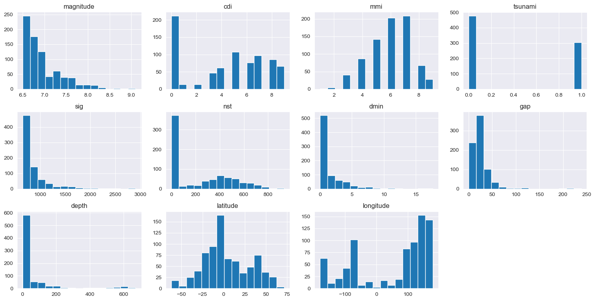
    


Figure 1: Histograms of Numerical Features

This histogram visualization reveals several important insights about the dataset.
- tsunami is a binary variable with most values being 0 (no tsunami).
- left skewed distributions appear common for `magnitude, sig, cdi, mmi, nst, dmin, gap, and depth.`
    - This suggests that most earthquakes in this dataset are of lower magnitude and general impact with a smaller collection of high magnitude and high impact events, these are likely to be the larger scale earthquakes.

### Feature and Target Identification

Looking at the sample dataset values below and the histograms above, we can see the features and target variables we will be working with for modeling tsunami prediction.


```python
df.sample(16)
```


<div>
<style scoped>
    .dataframe tbody tr th:only-of-type {
        vertical-align: middle;
    }

    .dataframe tbody tr th {
        vertical-align: top;
    }

    .dataframe thead th {
        text-align: right;
    }
</style>
<table border="1" class="dataframe">
  <thead>
    <tr style="text-align: right;">
      <th></th>
      <th>title</th>
      <th>magnitude</th>
      <th>date_time</th>
      <th>cdi</th>
      <th>mmi</th>
      <th>alert</th>
      <th>tsunami</th>
      <th>sig</th>
      <th>net</th>
      <th>nst</th>
      <th>dmin</th>
      <th>gap</th>
      <th>magType</th>
      <th>depth</th>
      <th>latitude</th>
      <th>longitude</th>
      <th>location</th>
      <th>continent</th>
      <th>country</th>
    </tr>
  </thead>
  <tbody>
    <tr>
      <th>421</th>
      <td>M 6.5 - 32 km SW of Champerico, Guatemala</td>
      <td>6.5</td>
      <td>11-11-2012 22:14</td>
      <td>4</td>
      <td>5</td>
      <td>NaN</td>
      <td>0</td>
      <td>708</td>
      <td>us</td>
      <td>598</td>
      <td>0.000</td>
      <td>57.3</td>
      <td>mww</td>
      <td>20.0</td>
      <td>14.1290</td>
      <td>-92.1640</td>
      <td>Champerico, Guatemala</td>
      <td>NaN</td>
      <td>NaN</td>
    </tr>
    <tr>
      <th>388</th>
      <td>M 7.3 - 190 km ENE of Kokopo, Papua New Guinea</td>
      <td>7.3</td>
      <td>07-07-2013 18:35</td>
      <td>0</td>
      <td>4</td>
      <td>green</td>
      <td>1</td>
      <td>820</td>
      <td>us</td>
      <td>117</td>
      <td>0.000</td>
      <td>24.0</td>
      <td>mww</td>
      <td>385.5</td>
      <td>-3.9170</td>
      <td>153.9270</td>
      <td>Kokopo, Papua New Guinea</td>
      <td>NaN</td>
      <td>Papua New Guinea</td>
    </tr>
    <tr>
      <th>345</th>
      <td>M 6.6 - 57 km SW of Panguna, Papua New Guinea</td>
      <td>6.6</td>
      <td>19-04-2014 01:04</td>
      <td>0</td>
      <td>6</td>
      <td>green</td>
      <td>1</td>
      <td>670</td>
      <td>us</td>
      <td>0</td>
      <td>3.803</td>
      <td>11.0</td>
      <td>mww</td>
      <td>29.0</td>
      <td>-6.6558</td>
      <td>155.0870</td>
      <td>Panguna, Papua New Guinea</td>
      <td>NaN</td>
      <td>Papua New Guinea</td>
    </tr>
    <tr>
      <th>30</th>
      <td>M 6.5 - Kermadec Islands region</td>
      <td>6.5</td>
      <td>29-01-2022 02:46</td>
      <td>7</td>
      <td>4</td>
      <td>green</td>
      <td>1</td>
      <td>651</td>
      <td>us</td>
      <td>0</td>
      <td>1.088</td>
      <td>57.0</td>
      <td>mww</td>
      <td>8.0</td>
      <td>-29.5350</td>
      <td>-176.7290</td>
      <td>Kermadec Islands region</td>
      <td>NaN</td>
      <td>NaN</td>
    </tr>
    <tr>
      <th>120</th>
      <td>M 6.8 - 96 km SW of San Antonio, Chile</td>
      <td>6.8</td>
      <td>01-08-2019 18:28</td>
      <td>6</td>
      <td>6</td>
      <td>green</td>
      <td>1</td>
      <td>947</td>
      <td>us</td>
      <td>0</td>
      <td>0.817</td>
      <td>35.0</td>
      <td>mww</td>
      <td>25.0</td>
      <td>-34.2364</td>
      <td>-72.3102</td>
      <td>San Antonio, Chile</td>
      <td>NaN</td>
      <td>NaN</td>
    </tr>
    <tr>
      <th>476</th>
      <td>M 9.1 - 2011 Great Tohoku Earthquake, Japan</td>
      <td>9.1</td>
      <td>11-03-2011 05:46</td>
      <td>9</td>
      <td>8</td>
      <td>NaN</td>
      <td>0</td>
      <td>2184</td>
      <td>official</td>
      <td>541</td>
      <td>0.000</td>
      <td>9.5</td>
      <td>mww</td>
      <td>29.0</td>
      <td>38.2970</td>
      <td>142.3730</td>
      <td>2011 Great Tohoku Earthquake, Japan</td>
      <td>NaN</td>
      <td>NaN</td>
    </tr>
    <tr>
      <th>559</th>
      <td>M 6.9 - 151 km E of Namie, Japan</td>
      <td>6.9</td>
      <td>19-07-2008 02:39</td>
      <td>5</td>
      <td>5</td>
      <td>NaN</td>
      <td>0</td>
      <td>825</td>
      <td>duputel</td>
      <td>0</td>
      <td>0.000</td>
      <td>0.0</td>
      <td>mww</td>
      <td>25.5</td>
      <td>37.5500</td>
      <td>142.7140</td>
      <td>Namie, Japan</td>
      <td>NaN</td>
      <td>NaN</td>
    </tr>
    <tr>
      <th>33</th>
      <td>M 6.5 - 71 km SE of Nikolski, Alaska</td>
      <td>6.5</td>
      <td>11-01-2022 12:39</td>
      <td>0</td>
      <td>3</td>
      <td>NaN</td>
      <td>1</td>
      <td>650</td>
      <td>pt</td>
      <td>23</td>
      <td>0.000</td>
      <td>208.8</td>
      <td>Mi</td>
      <td>37.0</td>
      <td>52.5020</td>
      <td>-168.0800</td>
      <td>Nikolski, Alaska</td>
      <td>NaN</td>
      <td>NaN</td>
    </tr>
    <tr>
      <th>148</th>
      <td>M 6.8 - 187 km E of Levuka, Fiji</td>
      <td>6.8</td>
      <td>18-11-2018 20:25</td>
      <td>0</td>
      <td>3</td>
      <td>green</td>
      <td>1</td>
      <td>711</td>
      <td>us</td>
      <td>0</td>
      <td>2.879</td>
      <td>39.0</td>
      <td>mww</td>
      <td>540.0</td>
      <td>-17.8735</td>
      <td>-178.9270</td>
      <td>Levuka, Fiji</td>
      <td>NaN</td>
      <td>Fiji</td>
    </tr>
    <tr>
      <th>68</th>
      <td>M 6.9 -</td>
      <td>6.9</td>
      <td>01-05-2021 01:27</td>
      <td>7</td>
      <td>6</td>
      <td>green</td>
      <td>1</td>
      <td>919</td>
      <td>us</td>
      <td>0</td>
      <td>2.619</td>
      <td>35.0</td>
      <td>mww</td>
      <td>43.0</td>
      <td>38.2296</td>
      <td>141.6650</td>
      <td>NaN</td>
      <td>Asia</td>
      <td>Japan</td>
    </tr>
    <tr>
      <th>123</th>
      <td>M 6.6 - 200km W of Broome, Australia</td>
      <td>6.6</td>
      <td>14-07-2019 05:39</td>
      <td>5</td>
      <td>5</td>
      <td>green</td>
      <td>0</td>
      <td>791</td>
      <td>us</td>
      <td>0</td>
      <td>2.978</td>
      <td>32.0</td>
      <td>mww</td>
      <td>10.0</td>
      <td>-18.2242</td>
      <td>120.3580</td>
      <td>Broome, Australia</td>
      <td>NaN</td>
      <td>NaN</td>
    </tr>
    <tr>
      <th>136</th>
      <td>M 6.7 - 5 km SW of Puerto Madero, Mexico</td>
      <td>6.7</td>
      <td>01-02-2019 16:14</td>
      <td>6</td>
      <td>6</td>
      <td>yellow</td>
      <td>1</td>
      <td>909</td>
      <td>us</td>
      <td>0</td>
      <td>0.289</td>
      <td>43.0</td>
      <td>mww</td>
      <td>66.0</td>
      <td>14.6802</td>
      <td>-92.4527</td>
      <td>Puerto Madero, Mexico</td>
      <td>NaN</td>
      <td>Mexico</td>
    </tr>
    <tr>
      <th>236</th>
      <td>M 6.6 - 161 km NNE of Pamanukan, Indonesia</td>
      <td>6.6</td>
      <td>19-10-2016 00:26</td>
      <td>3</td>
      <td>3</td>
      <td>green</td>
      <td>0</td>
      <td>677</td>
      <td>us</td>
      <td>0</td>
      <td>2.022</td>
      <td>16.0</td>
      <td>mww</td>
      <td>614.0</td>
      <td>-4.8626</td>
      <td>108.1630</td>
      <td>Pamanukan, Indonesia</td>
      <td>NaN</td>
      <td>Indonesia</td>
    </tr>
    <tr>
      <th>504</th>
      <td>M 6.9 - 233 km NNW of Qamdo, China</td>
      <td>6.9</td>
      <td>13-04-2010 23:49</td>
      <td>6</td>
      <td>9</td>
      <td>NaN</td>
      <td>0</td>
      <td>773</td>
      <td>us</td>
      <td>410</td>
      <td>0.000</td>
      <td>14.9</td>
      <td>mwc</td>
      <td>17.0</td>
      <td>33.1650</td>
      <td>96.5480</td>
      <td>Qamdo, China</td>
      <td>Asia</td>
      <td>People's Republic of China</td>
    </tr>
    <tr>
      <th>407</th>
      <td>M 6.6 - 30 km SSW of Lata, Solomon Islands</td>
      <td>6.6</td>
      <td>09-02-2013 21:02</td>
      <td>0</td>
      <td>6</td>
      <td>green</td>
      <td>1</td>
      <td>670</td>
      <td>us</td>
      <td>421</td>
      <td>0.000</td>
      <td>16.6</td>
      <td>mww</td>
      <td>18.0</td>
      <td>-10.9940</td>
      <td>165.7410</td>
      <td>Lata, Solomon Islands</td>
      <td>NaN</td>
      <td>Solomon Islands</td>
    </tr>
    <tr>
      <th>691</th>
      <td>M 6.7 - 105 km WNW of Naisano Dua, Indonesia</td>
      <td>6.7</td>
      <td>23-04-2004 01:50</td>
      <td>0</td>
      <td>5</td>
      <td>NaN</td>
      <td>0</td>
      <td>691</td>
      <td>us</td>
      <td>386</td>
      <td>0.000</td>
      <td>27.6</td>
      <td>mwb</td>
      <td>65.8</td>
      <td>-9.3620</td>
      <td>122.8390</td>
      <td>Naisano Dua, Indonesia</td>
      <td>NaN</td>
      <td>Indonesia</td>
    </tr>
  </tbody>
</table>
</div>


#### Features

`magnitude`, `cdi`, `mmi`, `sig`, `nst`, `dmin`, `gap`, `depth`, `latitude`, `longitude`,
`title`, `date_time`, `alert`, `net`, `magType`, `location`, `continent`, `country`

Further analysis is needed to confirm these feature types and their relevance to tsunami prediction.

---

#### Target Variable

**`tsunami`** – Tsunami occurrence indicator (`1 = tsunami`, `0 = no tsunami`)

Our target binary numerical variable represents whether a tsunami occurred following an earthquake event. The importance of this target If we model and predict this variable accurately, it could have significant implications for disaster preparedness and mitigation. For example, if we can predict tsunami occurrence based on earthquake characteristics, we can issue timely warnings to coastal communities, potentially saving lives and reducing property damage.

#### Statistical Summary

A statistical overview of the dataset including measures like ```mean, standard deviation, min, max, and quartiles``` for each numerical feature.


```python
df.describe()
```


<div>
<style scoped>
    .dataframe tbody tr th:only-of-type {
        vertical-align: middle;
    }

    .dataframe tbody tr th {
        vertical-align: top;
    }

    .dataframe thead th {
        text-align: right;
    }
</style>
<table border="1" class="dataframe">
  <thead>
    <tr style="text-align: right;">
      <th></th>
      <th>magnitude</th>
      <th>cdi</th>
      <th>mmi</th>
      <th>tsunami</th>
      <th>sig</th>
      <th>nst</th>
      <th>dmin</th>
      <th>gap</th>
      <th>depth</th>
      <th>latitude</th>
      <th>longitude</th>
    </tr>
  </thead>
  <tbody>
    <tr>
      <th>count</th>
      <td>782.000000</td>
      <td>782.000000</td>
      <td>782.000000</td>
      <td>782.000000</td>
      <td>782.000000</td>
      <td>782.000000</td>
      <td>782.000000</td>
      <td>782.000000</td>
      <td>782.000000</td>
      <td>782.000000</td>
      <td>782.000000</td>
    </tr>
    <tr>
      <th>mean</th>
      <td>6.941125</td>
      <td>4.333760</td>
      <td>5.964194</td>
      <td>0.388747</td>
      <td>870.108696</td>
      <td>230.250639</td>
      <td>1.325757</td>
      <td>25.038990</td>
      <td>75.883199</td>
      <td>3.538100</td>
      <td>52.609199</td>
    </tr>
    <tr>
      <th>std</th>
      <td>0.445514</td>
      <td>3.169939</td>
      <td>1.462724</td>
      <td>0.487778</td>
      <td>322.465367</td>
      <td>250.188177</td>
      <td>2.218805</td>
      <td>24.225067</td>
      <td>137.277078</td>
      <td>27.303429</td>
      <td>117.898886</td>
    </tr>
    <tr>
      <th>min</th>
      <td>6.500000</td>
      <td>0.000000</td>
      <td>1.000000</td>
      <td>0.000000</td>
      <td>650.000000</td>
      <td>0.000000</td>
      <td>0.000000</td>
      <td>0.000000</td>
      <td>2.700000</td>
      <td>-61.848400</td>
      <td>-179.968000</td>
    </tr>
    <tr>
      <th>25%</th>
      <td>6.600000</td>
      <td>0.000000</td>
      <td>5.000000</td>
      <td>0.000000</td>
      <td>691.000000</td>
      <td>0.000000</td>
      <td>0.000000</td>
      <td>14.625000</td>
      <td>14.000000</td>
      <td>-14.595600</td>
      <td>-71.668050</td>
    </tr>
    <tr>
      <th>50%</th>
      <td>6.800000</td>
      <td>5.000000</td>
      <td>6.000000</td>
      <td>0.000000</td>
      <td>754.000000</td>
      <td>140.000000</td>
      <td>0.000000</td>
      <td>20.000000</td>
      <td>26.295000</td>
      <td>-2.572500</td>
      <td>109.426000</td>
    </tr>
    <tr>
      <th>75%</th>
      <td>7.100000</td>
      <td>7.000000</td>
      <td>7.000000</td>
      <td>1.000000</td>
      <td>909.750000</td>
      <td>445.000000</td>
      <td>1.863000</td>
      <td>30.000000</td>
      <td>49.750000</td>
      <td>24.654500</td>
      <td>148.941000</td>
    </tr>
    <tr>
      <th>max</th>
      <td>9.100000</td>
      <td>9.000000</td>
      <td>9.000000</td>
      <td>1.000000</td>
      <td>2910.000000</td>
      <td>934.000000</td>
      <td>17.654000</td>
      <td>239.000000</td>
      <td>670.810000</td>
      <td>71.631200</td>
      <td>179.662000</td>
    </tr>
  </tbody>
</table>
</div>


There is a wide range of values across the different numerical features. This will be important to consider when we preprocess the data for modeling, as features with larger ranges may need to be scaled or normalized to ensure they are on a comparable scale to avoid unstable model training and convergence issues.


```python
print(f'Dataset Shape: {df.shape}')
print(f"Rows: {df.shape[0]}, Columns: {df.shape[1]}")
print('Column Names:', df.columns.tolist())
```

    Dataset Shape: (782, 19)
    Rows: 782, Columns: 19
    Column Names: ['title', 'magnitude', 'date_time', 'cdi', 'mmi', 'alert', 'tsunami', 'sig', 'net', 'nst', 'dmin', 'gap', 'magType', 'depth', 'latitude', 'longitude', 'location', 'continent', 'country']


### Data Types

Before proceeding with analysis or modeling, its important to understand the data types of each feature and the target in the dataset. This will help us determine how to handle each feature appropriately, espiecially when it comes to categorical vs numerical features, and any necessary preprocessing steps.


```python
unique_values = df.nunique()
print(f'Unique values per column:\n{unique_values}')
country_unique_variables_before_imputation = df['country'].nunique()
```

    Unique values per column:
    title        768
    magnitude     24
    date_time    773
    cdi           10
    mmi            9
    alert          4
    tsunami        2
    sig          339
    net           11
    nst          312
    dmin         369
    gap          256
    magType        9
    depth        303
    latitude     778
    longitude    777
    location     413
    continent      6
    country       49
    dtype: int64


```python
df.nunique(axis=0).plot(kind='bar')
plt.title('Unique Value Counts per Column')
plt.xlabel('Columns')
plt.ylabel('Unique Value Counts')
plt.show()
```


    
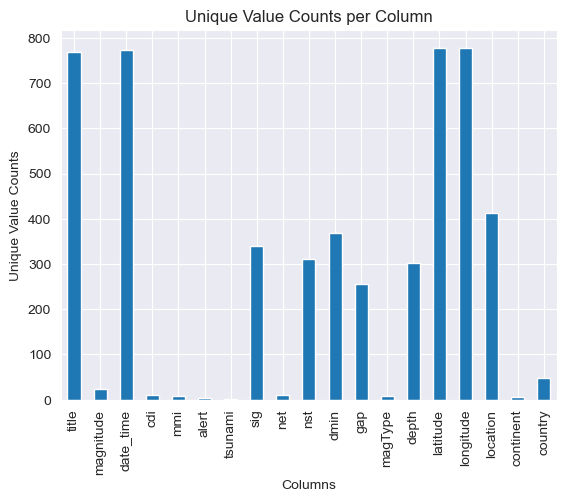
    


Figure 1: This chart shows the number of unique values for each dataset column. This is useful for identifying categorical features (which typically have a limited number of unique values) versus numerical features (which often have a larger number of unique values).


```python
print(df.dtypes)
```

    title         object
    magnitude    float64
    date_time     object
    cdi            int64
    mmi            int64
    alert         object
    tsunami        int64
    sig            int64
    net           object
    nst            int64
    dmin         float64
    gap          float64
    magType       object
    depth        float64
    latitude     float64
    longitude    float64
    location      object
    continent     object
    country       object
    dtype: object


The 'object' indicates string/categorical data types in pandas DataFrames, while 'float64' and 'int64' indicate numerical data types.

When deciding if a variable is categorical or numerical we considered that:
- Numerical variables typically have a large number of unique values (e.g., more than 15-20 unique values).
- Categorical variables usually have a limited number of unique values (e.g., less than 15-20 unique values) and often represent distinct categories or groups.
- Categorical variables can also be identified by their data type (e.g., 'object' in pandas).
- Textual data can be identified by sampling the data and looking at the values.

Numerical datatypes, `sig`,`nst`,`dmin`,`gap`,`depth`,`latitude`,`longitude` have a large number of unique values. However, features like `magnitude`, `cdi`, and `mmi` are numerical but have a limited number of unique values (as per figure 1) so could be treated as numerical or categorical. According to the USGS, `mmi` and `cdi` are both intensity scales that measure the effects of an earthquake, while `magnitude` measures the energy released. `magnitude` will therefore be treated numerical as it represents a continuous scale of energy release but `cdi` and `mmi` will be treated as ordered categorical features as they represent discrete intensity levels.

`country`, `contient`, `magType`,`alert`and `net` are categorical text features because they are of object data type and represent distinct categories shown by their lower relative unique value counts. `title` and `location` are unstructured text features because they are of object data type but have a higher relative unique value counts (shown in bar chart) of more free-form text data. `date_time` is a datetime feature.  Our target variable `tsunami` is a binary numerical variable having only has 2 unique values (0 and 1).

Magnitude

United States Geological Survey (USGS). (n.d.) What is the difference between earthquake magnitude and earthquake intensity? U.S. Geological Survey. Available at: https://www.usgs.gov/faqs/what-difference-between-earthquake-magnitude-and-earthquake-intensity-what-modified-mercalli (Accessed: 26 October 2025).
United States Geological Survey (USGS). (n.d.) Earthquake Hazards Program Glossary. U.S. Geological Survey. Available at: https://www.usgs.gov/glossary/earthquake-hazards-program (Accessed: 26 October 2025).

CDI (Community Determined Intensity)
Wald, D.J., Quitoriano, V., Worden, C.B., Hopper, M. and Dewey, J.W. (2011) USGS “Did You Feel It?”: Internet-based macroseismic intensity maps. Annals of Geophysics, 54(6), pp.688–707. Available at: https://www.researchgate.net/publication/268368064_USGS_Did_You_Feel_It_Internet-based_macroseismic_intensity_maps (Accessed: 26 October 2025).

MMI (Modified Mercalli Intensity)
United States Geological Survey (USGS). (n.d.) Modified Mercalli Intensity Scale. U.S. Geological Survey. Available at: https://www.usgs.gov/programs/earthquake-hazards/modified-mercalli-intensity-scale (Accessed: 26 October 2025).


Figure 2: Data Types of Features and Target Variable

| Types of data               | Features                                               |
|-----------------------------|--------------------------------------------------------|
| Numerical Features          | `magnitude`, `sig`, `nst`, `dmin`, `gap`, `depth`, `latitude`, `longitude` |
| Categorical Features        | `cdi`, `mmi`                                          |
| Datetime Feature            | `date_time`                                           |
| Categorical Text Feature   | `alert`, `net`, `magType`, `continent`, `country`          |
| Unstructured Text Feature   | `title`, `location`                                   |
| Target Variable (Binary Numerical) | `tsunami`                                             |


### Mapping my task to ML problem type

The goal is to predict the occurrence of tsunamis following earthquakes based on the characteristics of the seismic events. Given the target variable `tsunami` is binary (1 = tsunami, 0 = no tsunami), indicating whether a tsunami occurred after an earthquake event, this is a **binary classification** problem. Using the features of the earthquakes we will classify whether a tsunami will occur (1) or not (0) following an earthquake event.

#### Key features that will likely be important for predicting tsunami occurrence and there meaning

Observing C. Chauhan (2024) and applying general domain knowledge about earthquakes and tsunamis, the following features stand out as particularly relevant for predicting tsunamis :

- `magnitude`: Higher magnitude earthquakes are more likely to generate tsunamis.
- `latitude` and `longitude`: The geographical location of the earthquake can influence tsunami risk, especially near coastal areas.
- `cdi` and `mmi`: Higher intensity levels may correlate with tsunami generation.
- `sig`: More significant earthquakes may have a higher likelihood of causing tsunamis.


### Missing Values

It's important to check for any missing values in the dataset as they can impact model performance and limit the models we can use. We will identify the number of missing values and plan handling strategies.


```python
print(df.isnull().sum())
```

    title          0
    magnitude      0
    date_time      0
    cdi            0
    mmi            0
    alert        367
    tsunami        0
    sig            0
    net            0
    nst            0
    dmin           0
    gap            0
    magType        0
    depth          0
    latitude       0
    longitude      0
    location       5
    continent    576
    country      298
    dtype: int64


```python
place_holders = [-9999, 9999, np.inf, -np.inf, 'nan', 'NaN', 'NA', 'null', 'NULL', '']
print(df.isin(place_holders).sum().sum() + df.isnull().sum().sum())
```

    1246


There are 1246 missing values. These missing values appropriately before modeling either by imputation or removal depending on the context and extent.


```python
#percentage of missing values per column
missing_percentage = (df.isnull().sum() / len(df)) * 100
missing_percentage = missing_percentage[missing_percentage > 0]
print(f'Percentage of missing values per column:\n{missing_percentage}')
```

    Percentage of missing values per column:
    alert        46.930946
    location      0.639386
    continent    73.657289
    country      38.107417
    dtype: float64


```python
missing_values_datatypes = df[missing_percentage.index].dtypes
print(f'Data types of columns with missing values:\n{missing_values_datatypes}')
```

    Data types of columns with missing values:
    alert        object
    location     object
    continent    object
    country      object
    dtype: object


```python
df[missing_percentage.index].sample(16)
```


<div>
<style scoped>
    .dataframe tbody tr th:only-of-type {
        vertical-align: middle;
    }

    .dataframe tbody tr th {
        vertical-align: top;
    }

    .dataframe thead th {
        text-align: right;
    }
</style>
<table border="1" class="dataframe">
  <thead>
    <tr style="text-align: right;">
      <th></th>
      <th>alert</th>
      <th>location</th>
      <th>continent</th>
      <th>country</th>
    </tr>
  </thead>
  <tbody>
    <tr>
      <th>516</th>
      <td>NaN</td>
      <td>Lebu, Chile</td>
      <td>NaN</td>
      <td>NaN</td>
    </tr>
    <tr>
      <th>338</th>
      <td>green</td>
      <td>Kermadec Islands, New Zealand</td>
      <td>NaN</td>
      <td>NaN</td>
    </tr>
    <tr>
      <th>159</th>
      <td>red</td>
      <td>Palu, Indonesia</td>
      <td>NaN</td>
      <td>Indonesia</td>
    </tr>
    <tr>
      <th>650</th>
      <td>NaN</td>
      <td>San Juan del Sur, Nicaragua</td>
      <td>NaN</td>
      <td>NaN</td>
    </tr>
    <tr>
      <th>575</th>
      <td>NaN</td>
      <td>Gisborne, New Zealand</td>
      <td>NaN</td>
      <td>NaN</td>
    </tr>
    <tr>
      <th>261</th>
      <td>green</td>
      <td>Shizunai-furukawach?, Japan</td>
      <td>Asia</td>
      <td>Japan</td>
    </tr>
    <tr>
      <th>141</th>
      <td>green</td>
      <td>Tarauaca, Brazil</td>
      <td>South America</td>
      <td>Brazil</td>
    </tr>
    <tr>
      <th>602</th>
      <td>NaN</td>
      <td>Kashiwazaki, Japan</td>
      <td>Asia</td>
      <td>Japan</td>
    </tr>
    <tr>
      <th>273</th>
      <td>green</td>
      <td>Coquimbo, Chile</td>
      <td>NaN</td>
      <td>NaN</td>
    </tr>
    <tr>
      <th>537</th>
      <td>NaN</td>
      <td>Padang, Indonesia</td>
      <td>NaN</td>
      <td>Indonesia</td>
    </tr>
    <tr>
      <th>321</th>
      <td>green</td>
      <td>Tobelo, Indonesia</td>
      <td>NaN</td>
      <td>Indonesia</td>
    </tr>
    <tr>
      <th>345</th>
      <td>green</td>
      <td>Panguna, Papua New Guinea</td>
      <td>NaN</td>
      <td>Papua New Guinea</td>
    </tr>
    <tr>
      <th>119</th>
      <td>green</td>
      <td>Labuan, Indonesia</td>
      <td>NaN</td>
      <td>NaN</td>
    </tr>
    <tr>
      <th>309</th>
      <td>green</td>
      <td>Alo, Wallis and Futuna</td>
      <td>NaN</td>
      <td>NaN</td>
    </tr>
    <tr>
      <th>160</th>
      <td>green</td>
      <td>the Fiji Islands</td>
      <td>NaN</td>
      <td>NaN</td>
    </tr>
    <tr>
      <th>89</th>
      <td>green</td>
      <td>Katabu, Indonesia</td>
      <td>NaN</td>
      <td>Indonesia</td>
    </tr>
  </tbody>
</table>
</div>


Object in this context refers to string/categorical data types in pandas DataFrames.

Referencing figure 2, the columns missing values are either unstructured text features (`location`, `country`) or categorical text features (`alert`,`continent`). There are no missing values in numerical features.

#### Understanding missing data patterns

The columns missing values are all text features related to the location and alert level of earthquake events. This suggests it is not random and possibly related to the data collection process. Its possible that the alert level was not assigned for some events that didn't have a significant impact.

The location, country, and continent information was not recorded for certain earthquakes as the latitude and longitude was captured, ,making this information less critical for every event and more likely to be missing.

Alert level missingness is Missing Not At Random (MNAR) because the reason for missingness is related to the unobserved value itself (i.e., less significant earthquakes are less likely to have an alert level assigned).

Our location, country, and continent missingness is Missing At Random (MAR) because the missingness is related to other observed variables (i.e., latitude and longitude) rather than the missing values themselves.


#### Alert missing values imputation strategy


```python
#get unique values for alert column
df['alert'].value_counts().plot(kind='bar')
```


    <Axes: xlabel='alert'>


    
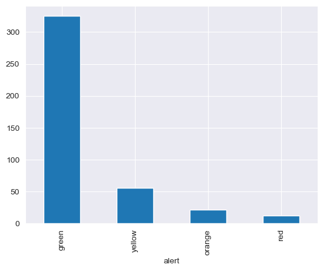
    


This charft tells us a few important things about the `alert` column:
- The most common alert level is "green", indicating low severity earthquakes.
- It has a small number of fixed categories (green, yellow, orange, red) which should make imputation easier.

If we encode the alert level from categorical to numerical, we can study it in a correlation matrix to see how other features relate to it and possibly use those relationships to impute missing alert values. This follows because alert levels are assigned based on earthquake characteristics like magnitude, intensity, and significance which are all numerical features.

As shown in figure 2, `alert` is a categorical text feature with 4 unique levels: green, yellow, orange, and red with different frequencies. The dataset has a left skewed distribution of earthquake magnitudes and impacts (figure 1), hence the lower severity alert levels (green and yellow) are more common than higher severity levels (orange and red). This strongly suggests that alert levels are related to earthquake characteristics which we can leverage for imputation.

`alert` is an ordinal categorical variable where the levels have a natural order of severity: green < yellow < orange < red. (source: https://earthquake.usgs.gov/data/pager/background.php)


```python
#ordinal encoding of alert levels
alert_order = {'green': 1, 'yellow': 2, 'orange': 3, 'red': 4}
df_temp = df.copy()
df_temp['alert_encoded'] = df_temp['alert'].map(alert_order)
numerical_cols = df_temp.select_dtypes(include=[np.number]).columns.tolist()
corr_matrix = df_temp[numerical_cols].corr()
plt.figure(figsize=(12,8))
sns.heatmap(corr_matrix, annot=True)
plt.title('Correlation Matrix')
plt.show()
```


    
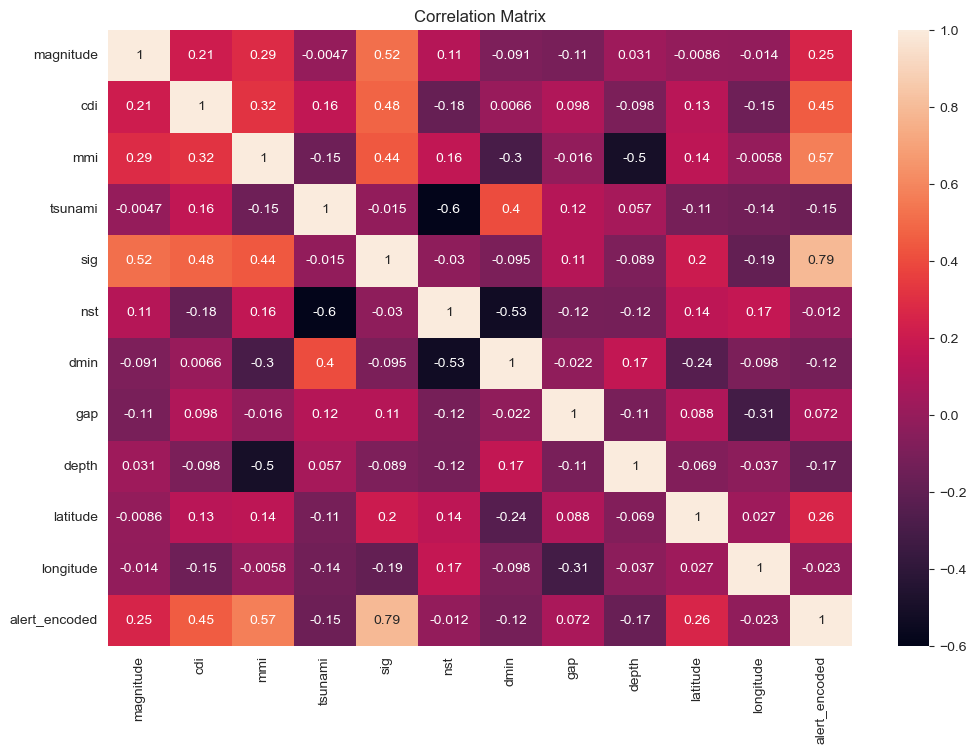
    


Studying the correlation matrix, we can see there is a strong correlation between `alert` and `sig` (0.79) so we will use this correlation to impute missing alert levels based on the `sig` value of each earthquake event.

This will be a rule based / conditional imputation strategy where we calculate the mean `sig` value for each alert level and use those thresholds to impute missing alert levels based on the `sig` value of each earthquake event.


```python
print(df.groupby('alert').agg({
    'sig': ['mean']
}).sig)
```

                   mean
    alert              
    green    773.224615
    orange  1382.136364
    red     2475.000000
    yellow  1047.696429


```python
alert_thresholds = df.groupby('alert').agg({
    'sig': ['mean']
}).sig

green_threshold = alert_thresholds.loc['green', 'mean'] #index by alert level, get column 'mean'
yellow_threshold = alert_thresholds.loc['yellow', 'mean']
orange_threshold = alert_thresholds.loc['orange', 'mean']
red_threshold = alert_thresholds.loc['red', 'mean']

#Order of alert levels: red, orange, yellow, green - source: https://earthquake.usgs.gov/data/pager/background.php

def impute_alert(row):
    if pd.isnull(row['alert']):
        if row['magnitude'] >= red_threshold:
            return 'red'
        elif row['magnitude'] >= orange_threshold:
            return 'orange'
        elif row['magnitude'] >= yellow_threshold:
            return 'yellow'
        else:
            return 'green'
    else:
        return row['alert']
#apply the imputation function
df['alert'] = df.apply(impute_alert, axis=1)
#verify no more missing values in alert column
print(f'Missing values in alert column after imputation: {df["alert"].isnull().sum()}')
```

    Missing values in alert column after imputation: 0


#### Location missing values imputation strategy


```python
msno.matrix(df)
```


    <Axes: >


    
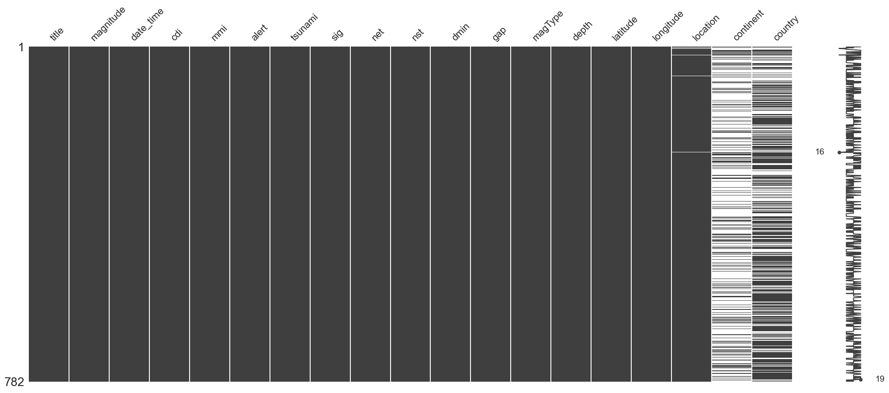
    


`Location` is closely related to the `country` feature as it describes the area within the country. `location` is an unstructured text feature and `country` categorical text feature and, given they are the same type of data, we can use one to impute missing values in the other.

The true location values will have a more precise description of the area within the country but, using this strategy, is better than having no location information at all. This is possible because the missing matrix shows that in many cases where `location` is missing, `country` is present.


This is another example of rule based / conditional imputation but this time based on the categorical relationship between the `location` and `country` features.


```python
print(f'Missing values in location column before imputation: {df["location"].isnull().sum()}')
def impute_location(row):
    if pd.isnull(row['location']):
        if not pd.isnull(row['country']):
            return f'{row["country"]}'
        else:
            return np.nan # cannot impute location
    else:
        return row['location']
#apply the imputation function
df['location'] = df.apply(impute_location, axis=1)
#verify no more missing values in location column
print(f'Missing values in location column after imputation: {df["location"].isnull().sum()}')
```

    Missing values in location column before imputation: 5
    Missing values in location column after imputation: 3


```python
df = df.dropna(subset=['location'])
print('Data shape after dropping rows with missing location:', df.shape)
```

    Data shape after dropping rows with missing location: (779, 19)


The remaining missing values in the location column are those where both location and country were missing so we could not impute anything meaningful and have dropped these rows from the dataset. This will remove 3 rows from the dataset, leaving us with 779 samples.


```python
print(df.location.sample(15))
```

    67        Mauritius - Reunion region
    676             Maubara, Timor Leste
    134                   Azángaro, Peru
    157          Kimbe, Papua New Guinea
    99       San Pedro de Atacama, Chile
    221                   Quellón, Chile
    337    Kermadec Islands, New Zealand
    48                  Acapulco, Mexico
    271                  Lefkáda, Greece
    772               Ternate, Indonesia
    686                    Shing?, Japan
    471                Tachilek, Myanmar
    6                   the Fiji Islands
    679                     Ojiya, Japan
    363             the Kermadec Islands
    Name: location, dtype: object


#### Country missing values imputation strategy


```python
coma_count = df['location'].str.contains(',').sum()
print(f'Percentage of locations with a comma: {(coma_count / len(df)) * 100:.2f}%')
```

    Percentage of locations with a comma: 91.40%


The random samples above show many of the location entries contain a comma, indicating both a specific area and the country name (e.g., "Los Angeles, USA"). This infomation can help us populate missing country values from the location column by taking the substring after the comma as the country and, given the quantity of missing country values (298), this will introduce some multi-collinearity.

I believe this is acceptable as having some country information is better than none at all for our modeling and, similar to using the `country` feature to impute missing `location` values, we can use the `location` feature to impute missing `country` values.

This is another example of rule based / conditional imputation based on the relationship between the `location` and `country` features.


```python
print(f'Missing values in country column before imputation: {df["country"].isnull().sum()}')
def impute_country(row):
    if pd.isnull(row['country']):
        if ',' in row['location']:
            return row['location'].split(',')[-1].strip() # extract country from location using the last part after comma
        else:
            return np.nan # cannot impute country
    else:
        return row['country']
#apply the imputation function

#verify no more missing values in country column
df['country'] = df.apply(impute_country, axis=1)
print(f'Missing values in country column after imputation: {df["country"].isnull().sum()}')
```

    Missing values in country column before imputation: 295
    Missing values in country column after imputation: 42


```python
missing_country_locations = df[df['country'].isnull()]['location']
print(f'Locations with missing country values:\n{missing_country_locations}')
```

    Locations with missing country values:
    5                            the Fiji Islands
    6                            the Fiji Islands
    15                       the Kermadec Islands
    22                        the Loyalty Islands
    28                           the Fiji Islands
    30                    Kermadec Islands region
    45                             Vanuatu region
    46                             Vanuatu region
    52              South Sandwich Islands region
    56              South Sandwich Islands region
    57              South Sandwich Islands region
    67                 Mauritius - Reunion region
    73                    Kermadec Islands region
    78                        the Loyalty Islands
    85                 central Mid-Atlantic Ridge
    88                 central Mid-Atlantic Ridge
    97                       the Kermadec Islands
    137              Prince Edward Islands region
    160                          the Fiji Islands
    161                   Kermadec Islands region
    186                      Bouvet Island region
    208             South Sandwich Islands region
    214                          the Fiji Islands
    242                       the Loyalty Islands
    245             South Sandwich Islands region
    325                               Fiji region
    329                         Micronesia region
    335             South Sandwich Islands region
    363                      the Kermadec Islands
    365                               Fiji region
    374                                   Okhotsk
    389               northern Mid-Atlantic Ridge
    392                                   Okhotsk
    393                                   Okhotsk
    440    off the west coast of northern Sumatra
    441    off the west coast of northern Sumatra
    448    off the west coast of northern Sumatra
    464                   Kermadec Islands region
    566                 Philippine Islands region
    611                         the Kuril Islands
    614                             Kuril Islands
    669                          Macquarie Island
    Name: location, dtype: object


Looking at the 42 remaining samples without country information, a lot of these are either small islands (fiji), semi-independent territories (Okhotsk), general oceanic regions (off the west coast of northern Sumatra) or disputed areas (the Kuril Islands).

Having analysed this data, i'm confident these values represent similar value to countries and will therefore impute these missing country values with the location value itself for these instances.


```python
df['country'] = df['country'].fillna(df['location'])
#verify no more missing values in country column
print(f'Missing values in country column after final imputation: {df["country"].isnull().sum()}')
```

    Missing values in country column after final imputation: 0


#### Continent missing values imputation strategy


```python
msno.matrix(df[['continent', 'country', 'location']])
```


    <Axes: >


    
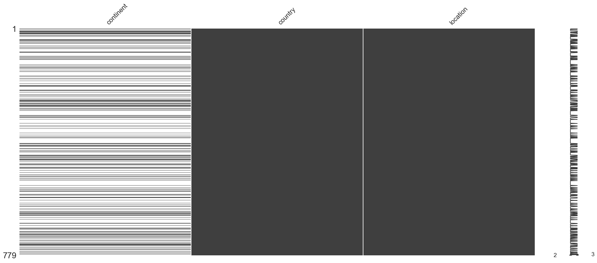
    


Data missing from the 'contient' column is 73%. Given this high level of missingness, it is therefore more practical to drop the 'continent' column entirely from the dataset rather than attempting to impute the missing values. Imputing such a large proportion of missing data could introduce significant bias and uncertainty into the dataset.


```python
df = df.drop(columns=['continent'])
print(df.columns)
```

    Index(['title', 'magnitude', 'date_time', 'cdi', 'mmi', 'alert', 'tsunami',
           'sig', 'net', 'nst', 'dmin', 'gap', 'magType', 'depth', 'latitude',
           'longitude', 'location', 'country'],
          dtype='object')


#### Visualizing missing data pattern after imputation


```python
total_missing_after = df.isnull().sum().sum()
print(f'Total missing values after imputation: {total_missing_after}')
```

    Total missing values after imputation: 0


```python
X, y = df.drop(columns='tsunami'), df['tsunami']
X.shape, y.shape, X.columns
```


    ((779, 17),
     (779,),
     Index(['title', 'magnitude', 'date_time', 'cdi', 'mmi', 'alert', 'sig', 'net',
            'nst', 'dmin', 'gap', 'magType', 'depth', 'latitude', 'longitude',
            'location', 'country'],
           dtype='object'))


X is our new Dataframe containing all features except the target variable `tsunami`, and y is a Series containing target variable `tsunami` which we will predict.

X a fully imputed feature set with no missing values, and y `tsunami` didn't have any missing values to begin with.

### Encoding Categorical Features and Text Features

We must encode categorical features into numerical format before modeling as most machine learning algorithms require numerical input. We will use one-hot encoding for nominal categorical features and ordinal encoding for ordinal categorical features (figure 2)

During our feature type identification earlier, we determined that `cdi` and `mmi` are ordinal categorical features based on REFERENCES FROM US EARTHQUAKE DATA as they represent intensity levels with a natural order of severity and have a limited number of unique values. These features do not need encoding as they are already in numerical format.

`alert`, is also an ordinal categorical variable so we will apply ordinal encoding as it is currently in a categorical text format and needs to be converted to numerical format for modeling.


```python
from sklearn.preprocessing import OrdinalEncoder
ordinal_features = ['alert']
ordinal_encoder = OrdinalEncoder(categories=[['green', 'yellow', 'orange', 'red']])
X[ordinal_features] = ordinal_encoder.fit_transform(X[ordinal_features])
```

We must also encode our other categorical text features: `net`, `magType`,`Contient`, and `country` (figure 2). These are nominal categorical variables (C. Chauhan, 2024) as there is no inherent order to the categories they represent. We will use one-hot encoding to convert these nominal categorical features into numerical format by creating binary indicator variables for each category.


```python
#one-hot encoding of nominal categorical features
columns_before = X.shape[1]
nominal_features = ['net', 'magType']
X = pd.get_dummies(X, columns=nominal_features, drop_first=True)
columns_after = X.shape[1]
```


```python
print(country_unique_variables_before_imputation)
print(df.country.nunique())
plt.bar(['Before Imputation', 'After Imputation'], [country_unique_variables_before_imputation, df.country.nunique()])
plt.title('Unique Country Values Before and After Imputation')
plt.ylabel('Unique Value Count')
plt.show()
```

    49
    87


    
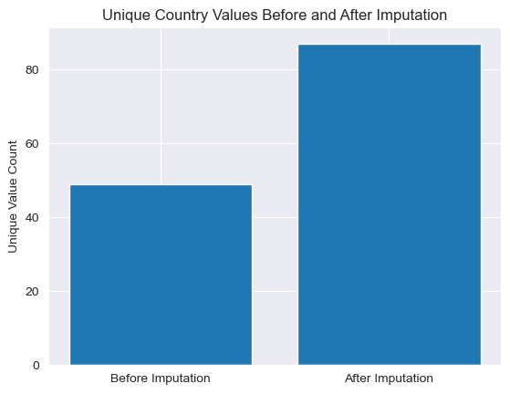
    


Having imputed missing values in the `country` feature earlier its unique value count has grown from 49 to 87 unique values. This is expected as we filled in missing country values using location data, which introduced new country names that were not present before imputation. This means our one-hot encoding of the `country` feature will now create 86 new binary columns (after dropping the first to avoid multicollinearity) instead of 48 as before imputation. To avoid high dimensionality and overfitting, we are going to use target encoding for the `country` feature. This will reduce the number of new features created while still capturing the relationship between country and tsunami occurrences.

Target encoding involves replacing each category in the `country` feature with the mean of the target variable (`tsunami`) for that category. This way, we convert the categorical `country` feature into a single numerical feature that reflects the average tsunami occurrence rate for each country.


```python
country_target_mean = y.groupby(X['country']).mean()
X['country_encoded'] = X['country'].map(country_target_mean)
X = X.drop(columns=['country'])
X
```


<div>
<style scoped>
    .dataframe tbody tr th:only-of-type {
        vertical-align: middle;
    }

    .dataframe tbody tr th {
        vertical-align: top;
    }

    .dataframe thead th {
        text-align: right;
    }
</style>
<table border="1" class="dataframe">
  <thead>
    <tr style="text-align: right;">
      <th></th>
      <th>title</th>
      <th>magnitude</th>
      <th>date_time</th>
      <th>cdi</th>
      <th>mmi</th>
      <th>alert</th>
      <th>sig</th>
      <th>nst</th>
      <th>dmin</th>
      <th>gap</th>
      <th>...</th>
      <th>net_uw</th>
      <th>magType_mb</th>
      <th>magType_md</th>
      <th>magType_ml</th>
      <th>magType_ms</th>
      <th>magType_mw</th>
      <th>magType_mwb</th>
      <th>magType_mwc</th>
      <th>magType_mww</th>
      <th>country_encoded</th>
    </tr>
  </thead>
  <tbody>
    <tr>
      <th>0</th>
      <td>M 7.0 - 18 km SW of Malango, Solomon Islands</td>
      <td>7.0</td>
      <td>22-11-2022 02:03</td>
      <td>8</td>
      <td>7</td>
      <td>0.0</td>
      <td>768</td>
      <td>117</td>
      <td>0.509</td>
      <td>17.0</td>
      <td>...</td>
      <td>False</td>
      <td>False</td>
      <td>False</td>
      <td>False</td>
      <td>False</td>
      <td>False</td>
      <td>False</td>
      <td>False</td>
      <td>True</td>
      <td>0.500000</td>
    </tr>
    <tr>
      <th>1</th>
      <td>M 6.9 - 204 km SW of Bengkulu, Indonesia</td>
      <td>6.9</td>
      <td>18-11-2022 13:37</td>
      <td>4</td>
      <td>4</td>
      <td>0.0</td>
      <td>735</td>
      <td>99</td>
      <td>2.229</td>
      <td>34.0</td>
      <td>...</td>
      <td>False</td>
      <td>False</td>
      <td>False</td>
      <td>False</td>
      <td>False</td>
      <td>False</td>
      <td>False</td>
      <td>False</td>
      <td>True</td>
      <td>0.109244</td>
    </tr>
    <tr>
      <th>2</th>
      <td>M 7.0 -</td>
      <td>7.0</td>
      <td>12-11-2022 07:09</td>
      <td>3</td>
      <td>3</td>
      <td>0.0</td>
      <td>755</td>
      <td>147</td>
      <td>3.125</td>
      <td>18.0</td>
      <td>...</td>
      <td>False</td>
      <td>False</td>
      <td>False</td>
      <td>False</td>
      <td>False</td>
      <td>False</td>
      <td>False</td>
      <td>False</td>
      <td>True</td>
      <td>0.750000</td>
    </tr>
    <tr>
      <th>3</th>
      <td>M 7.3 - 205 km ESE of Neiafu, Tonga</td>
      <td>7.3</td>
      <td>11-11-2022 10:48</td>
      <td>5</td>
      <td>5</td>
      <td>0.0</td>
      <td>833</td>
      <td>149</td>
      <td>1.865</td>
      <td>21.0</td>
      <td>...</td>
      <td>False</td>
      <td>False</td>
      <td>False</td>
      <td>False</td>
      <td>False</td>
      <td>False</td>
      <td>False</td>
      <td>False</td>
      <td>True</td>
      <td>0.416667</td>
    </tr>
    <tr>
      <th>5</th>
      <td>M 7.0 - south of the Fiji Islands</td>
      <td>7.0</td>
      <td>09-11-2022 09:51</td>
      <td>4</td>
      <td>3</td>
      <td>0.0</td>
      <td>755</td>
      <td>142</td>
      <td>4.578</td>
      <td>26.0</td>
      <td>...</td>
      <td>False</td>
      <td>False</td>
      <td>False</td>
      <td>False</td>
      <td>False</td>
      <td>False</td>
      <td>True</td>
      <td>False</td>
      <td>False</td>
      <td>0.800000</td>
    </tr>
    <tr>
      <th>...</th>
      <td>...</td>
      <td>...</td>
      <td>...</td>
      <td>...</td>
      <td>...</td>
      <td>...</td>
      <td>...</td>
      <td>...</td>
      <td>...</td>
      <td>...</td>
      <td>...</td>
      <td>...</td>
      <td>...</td>
      <td>...</td>
      <td>...</td>
      <td>...</td>
      <td>...</td>
      <td>...</td>
      <td>...</td>
      <td>...</td>
      <td>...</td>
    </tr>
    <tr>
      <th>777</th>
      <td>M 7.7 - 28 km SSW of Puerto El Triunfo, El Sal...</td>
      <td>7.7</td>
      <td>13-01-2001 17:33</td>
      <td>0</td>
      <td>8</td>
      <td>0.0</td>
      <td>912</td>
      <td>427</td>
      <td>0.000</td>
      <td>0.0</td>
      <td>...</td>
      <td>False</td>
      <td>False</td>
      <td>False</td>
      <td>False</td>
      <td>False</td>
      <td>False</td>
      <td>False</td>
      <td>True</td>
      <td>False</td>
      <td>0.500000</td>
    </tr>
    <tr>
      <th>778</th>
      <td>M 6.9 - 47 km S of Old Harbor, Alaska</td>
      <td>6.9</td>
      <td>10-01-2001 16:02</td>
      <td>5</td>
      <td>7</td>
      <td>0.0</td>
      <td>745</td>
      <td>0</td>
      <td>0.000</td>
      <td>0.0</td>
      <td>...</td>
      <td>False</td>
      <td>False</td>
      <td>False</td>
      <td>False</td>
      <td>False</td>
      <td>True</td>
      <td>False</td>
      <td>False</td>
      <td>False</td>
      <td>0.850000</td>
    </tr>
    <tr>
      <th>779</th>
      <td>M 7.1 - 16 km NE of Port-Olry, Vanuatu</td>
      <td>7.1</td>
      <td>09-01-2001 16:49</td>
      <td>0</td>
      <td>7</td>
      <td>0.0</td>
      <td>776</td>
      <td>372</td>
      <td>0.000</td>
      <td>0.0</td>
      <td>...</td>
      <td>False</td>
      <td>False</td>
      <td>False</td>
      <td>False</td>
      <td>False</td>
      <td>False</td>
      <td>True</td>
      <td>False</td>
      <td>False</td>
      <td>0.365854</td>
    </tr>
    <tr>
      <th>780</th>
      <td>M 6.8 - Mindanao, Philippines</td>
      <td>6.8</td>
      <td>01-01-2001 08:54</td>
      <td>0</td>
      <td>5</td>
      <td>0.0</td>
      <td>711</td>
      <td>64</td>
      <td>0.000</td>
      <td>0.0</td>
      <td>...</td>
      <td>False</td>
      <td>False</td>
      <td>False</td>
      <td>False</td>
      <td>False</td>
      <td>False</td>
      <td>False</td>
      <td>True</td>
      <td>False</td>
      <td>0.583333</td>
    </tr>
    <tr>
      <th>781</th>
      <td>M 7.5 - 21 km SE of Lukatan, Philippines</td>
      <td>7.5</td>
      <td>01-01-2001 06:57</td>
      <td>0</td>
      <td>7</td>
      <td>0.0</td>
      <td>865</td>
      <td>324</td>
      <td>0.000</td>
      <td>0.0</td>
      <td>...</td>
      <td>False</td>
      <td>False</td>
      <td>False</td>
      <td>False</td>
      <td>False</td>
      <td>False</td>
      <td>False</td>
      <td>True</td>
      <td>False</td>
      <td>0.583333</td>
    </tr>
  </tbody>
</table>
<p>779 rows × 33 columns</p>
</div>


Now we must process our unstructured text features: `title` and `location` (figure 2). These features contain free-form text data that cannot be directly used in most ML models so we will need to convert this text data into numerical format using text vectorization techniques.


We will use Word2Vec embeddings to convert the `title` and `location` text features into numerical vectors. Word2Vec is a popular word embedding technique that represents words as dense vectors in a continuous numerical space, capturing semantic relationships between words based on their context in the text. However, we will average these word vectors to create a single vector representation for each entire text entry in the `title` and `location` features. This approach allows us to capture the overall meaning of the text while reducing dimensionality compared to using individual word vectors. This is because we don't want to create a huge amount of features relative to our dataset size of 782 samples which could lead to overfitting.

This averaging approach does lose some contextual information about word order and relationships within the text, but it provides a practical way to incorporate unstructured text data into our model while keeping the feature set manageable.

The choice of `glove-wiki-gigaword-50` is a balance between capturing semantic meaning and efficiency. This means each word is represented by a 50-dimensional vector, which is sufficient to capture important semantic relationships while keeping the computational requirements manageable for our dataset size.

Reference: https://stats.stackexchange.com/questions/318882/what-does-average-of-word2vec-vector-mean


```python
import gensim.downloader as api
word2vec_model = api.load('glove-wiki-gigaword-50') #pre-trained Word2Vec model with 50-dimensional vectors

def average_word_vectors(text, model):
    words = str(text).lower().split()
    vectors = []
    for words in words:
        if words in model: #When you iterate through model, you get the words in the vocabulary (it must have a custom __iter__ method)
            vectors.append(model[words])
    if vectors:
        return np.mean(vectors, axis=0)
    else:
        return np.zeros(model.vector_size)

#apply the averaging function to title and location columns
title_vectors = X['title'].apply(lambda x: average_word_vectors(x, word2vec_model))
location_vectors = X['location'].apply(lambda x: average_word_vectors(x, word2vec_model))
title_df = pd.DataFrame(title_vectors.tolist(), index=X.index).add_prefix('title_vec_') #take index from original X to align rows
location_df = pd.DataFrame(location_vectors.tolist(), index=X.index).add_prefix('location_vec_')
X = pd.concat([X, title_df, location_df], axis=1)
X = X.drop(columns=['title', 'location'])
X
```


<div>
<style scoped>
    .dataframe tbody tr th:only-of-type {
        vertical-align: middle;
    }

    .dataframe tbody tr th {
        vertical-align: top;
    }

    .dataframe thead th {
        text-align: right;
    }
</style>
<table border="1" class="dataframe">
  <thead>
    <tr style="text-align: right;">
      <th></th>
      <th>magnitude</th>
      <th>date_time</th>
      <th>cdi</th>
      <th>mmi</th>
      <th>alert</th>
      <th>sig</th>
      <th>nst</th>
      <th>dmin</th>
      <th>gap</th>
      <th>depth</th>
      <th>...</th>
      <th>location_vec_40</th>
      <th>location_vec_41</th>
      <th>location_vec_42</th>
      <th>location_vec_43</th>
      <th>location_vec_44</th>
      <th>location_vec_45</th>
      <th>location_vec_46</th>
      <th>location_vec_47</th>
      <th>location_vec_48</th>
      <th>location_vec_49</th>
    </tr>
  </thead>
  <tbody>
    <tr>
      <th>0</th>
      <td>7.0</td>
      <td>22-11-2022 02:03</td>
      <td>8</td>
      <td>7</td>
      <td>0.0</td>
      <td>768</td>
      <td>117</td>
      <td>0.509</td>
      <td>17.0</td>
      <td>14.0</td>
      <td>...</td>
      <td>-0.413625</td>
      <td>1.011540</td>
      <td>0.835310</td>
      <td>-0.672395</td>
      <td>-1.054485</td>
      <td>0.468645</td>
      <td>-0.376000</td>
      <td>-0.737735</td>
      <td>-0.421065</td>
      <td>-0.443805</td>
    </tr>
    <tr>
      <th>1</th>
      <td>6.9</td>
      <td>18-11-2022 13:37</td>
      <td>4</td>
      <td>4</td>
      <td>0.0</td>
      <td>735</td>
      <td>99</td>
      <td>2.229</td>
      <td>34.0</td>
      <td>25.0</td>
      <td>...</td>
      <td>-1.397400</td>
      <td>0.328640</td>
      <td>0.903000</td>
      <td>-1.181100</td>
      <td>0.236450</td>
      <td>1.036200</td>
      <td>-0.586330</td>
      <td>0.309870</td>
      <td>0.325110</td>
      <td>-1.210100</td>
    </tr>
    <tr>
      <th>2</th>
      <td>7.0</td>
      <td>12-11-2022 07:09</td>
      <td>3</td>
      <td>3</td>
      <td>0.0</td>
      <td>755</td>
      <td>147</td>
      <td>3.125</td>
      <td>18.0</td>
      <td>579.0</td>
      <td>...</td>
      <td>-0.678180</td>
      <td>0.542310</td>
      <td>0.366070</td>
      <td>-0.350280</td>
      <td>-0.664370</td>
      <td>1.286700</td>
      <td>-0.978370</td>
      <td>0.141160</td>
      <td>0.803460</td>
      <td>-0.977450</td>
    </tr>
    <tr>
      <th>3</th>
      <td>7.3</td>
      <td>11-11-2022 10:48</td>
      <td>5</td>
      <td>5</td>
      <td>0.0</td>
      <td>833</td>
      <td>149</td>
      <td>1.865</td>
      <td>21.0</td>
      <td>37.0</td>
      <td>...</td>
      <td>-0.083787</td>
      <td>0.562320</td>
      <td>0.343680</td>
      <td>-0.498550</td>
      <td>-0.811640</td>
      <td>1.716400</td>
      <td>-0.491980</td>
      <td>0.052259</td>
      <td>0.706380</td>
      <td>-0.809750</td>
    </tr>
    <tr>
      <th>5</th>
      <td>7.0</td>
      <td>09-11-2022 09:51</td>
      <td>4</td>
      <td>3</td>
      <td>0.0</td>
      <td>755</td>
      <td>142</td>
      <td>4.578</td>
      <td>26.0</td>
      <td>660.0</td>
      <td>...</td>
      <td>-0.508930</td>
      <td>0.422533</td>
      <td>0.538463</td>
      <td>-0.348069</td>
      <td>-0.877760</td>
      <td>0.618010</td>
      <td>-0.535445</td>
      <td>-0.326447</td>
      <td>0.172120</td>
      <td>-0.906737</td>
    </tr>
    <tr>
      <th>...</th>
      <td>...</td>
      <td>...</td>
      <td>...</td>
      <td>...</td>
      <td>...</td>
      <td>...</td>
      <td>...</td>
      <td>...</td>
      <td>...</td>
      <td>...</td>
      <td>...</td>
      <td>...</td>
      <td>...</td>
      <td>...</td>
      <td>...</td>
      <td>...</td>
      <td>...</td>
      <td>...</td>
      <td>...</td>
      <td>...</td>
      <td>...</td>
    </tr>
    <tr>
      <th>777</th>
      <td>7.7</td>
      <td>13-01-2001 17:33</td>
      <td>0</td>
      <td>8</td>
      <td>0.0</td>
      <td>912</td>
      <td>427</td>
      <td>0.000</td>
      <td>0.0</td>
      <td>60.0</td>
      <td>...</td>
      <td>-0.525199</td>
      <td>0.588573</td>
      <td>0.626350</td>
      <td>-1.385473</td>
      <td>-0.272928</td>
      <td>-0.331966</td>
      <td>-0.926685</td>
      <td>-0.707303</td>
      <td>0.474065</td>
      <td>-0.023720</td>
    </tr>
    <tr>
      <th>778</th>
      <td>6.9</td>
      <td>10-01-2001 16:02</td>
      <td>5</td>
      <td>7</td>
      <td>0.0</td>
      <td>745</td>
      <td>0</td>
      <td>0.000</td>
      <td>0.0</td>
      <td>36.4</td>
      <td>...</td>
      <td>-0.602380</td>
      <td>0.546825</td>
      <td>0.408775</td>
      <td>0.057960</td>
      <td>-0.438345</td>
      <td>0.065940</td>
      <td>-0.293385</td>
      <td>-0.393100</td>
      <td>-0.215465</td>
      <td>-0.072315</td>
    </tr>
    <tr>
      <th>779</th>
      <td>7.1</td>
      <td>09-01-2001 16:49</td>
      <td>0</td>
      <td>7</td>
      <td>0.0</td>
      <td>776</td>
      <td>372</td>
      <td>0.000</td>
      <td>0.0</td>
      <td>103.0</td>
      <td>...</td>
      <td>-0.660620</td>
      <td>0.921090</td>
      <td>0.486700</td>
      <td>-1.248600</td>
      <td>-1.001100</td>
      <td>0.611220</td>
      <td>-0.338700</td>
      <td>0.311190</td>
      <td>0.707830</td>
      <td>-0.753600</td>
    </tr>
    <tr>
      <th>780</th>
      <td>6.8</td>
      <td>01-01-2001 08:54</td>
      <td>0</td>
      <td>5</td>
      <td>0.0</td>
      <td>711</td>
      <td>64</td>
      <td>0.000</td>
      <td>0.0</td>
      <td>33.0</td>
      <td>...</td>
      <td>-1.447600</td>
      <td>0.193520</td>
      <td>0.699930</td>
      <td>-1.508400</td>
      <td>-0.045248</td>
      <td>0.242790</td>
      <td>-0.459550</td>
      <td>-0.234900</td>
      <td>0.175560</td>
      <td>-0.527280</td>
    </tr>
    <tr>
      <th>781</th>
      <td>7.5</td>
      <td>01-01-2001 06:57</td>
      <td>0</td>
      <td>7</td>
      <td>0.0</td>
      <td>865</td>
      <td>324</td>
      <td>0.000</td>
      <td>0.0</td>
      <td>33.0</td>
      <td>...</td>
      <td>-1.447600</td>
      <td>0.193520</td>
      <td>0.699930</td>
      <td>-1.508400</td>
      <td>-0.045248</td>
      <td>0.242790</td>
      <td>-0.459550</td>
      <td>-0.234900</td>
      <td>0.175560</td>
      <td>-0.527280</td>
    </tr>
  </tbody>
</table>
<p>779 rows × 131 columns</p>
</div>


#### Not all models require only numerical input features.
 decsion trees and ensemble models can handle categorical features directly. However, many popular machine learning algorithms, such as logistic regression require numerical input features. So in order to do a fair comparision later on between different model types, we will convert all categorical features to numerical format now.


```python
object_columns = X.select_dtypes(include=['object']).columns.tolist()
print(f'Object type columns in X: {object_columns}')
```

    Object type columns in X: ['date_time']


Finally we must process our datetime feature: `date_time` (figure 2). Most machine learning algorithms cannot directly handle datetime features, so we need to extract relevant numerical components from the datetime data that can be used as input features for modeling.


```python
X['date_time'] = pd.to_datetime(X['date_time'])
X.date_time.dtype
```

    /var/folders/ch/bfx06mdj29ndjk1wx8vb4pz00000gn/T/ipykernel_89657/2631669616.py:1: UserWarning: Parsing dates in %d-%m-%Y %H:%M format when dayfirst=False (the default) was specified. Pass `dayfirst=True` or specify a format to silence this warning.
      X['date_time'] = pd.to_datetime(X['date_time'])


    dtype('<M8[ns]')


```python
object_columns = X.select_dtypes(include=['object']).columns.tolist()
print(f'Object type columns in X: {object_columns}')
```

    Object type columns in X: []


### Further data visualization and issue identification

We are doing to check our data for any remaining issues that could impact modeling such as outliers, feature distributions, and feature correlations.

Its important we do this before scaling our features so we can see the raw distributions and relationships between features, otherwise we would need to inverse transform the scaled features back to their original scale for meaningful interpretation.

However, we cannot visualize all features due to the high dimensionality introduced by one-hot encoding and text vectorization. Instead, we will focus on the non-encoded numerical features for visualization.


```python
non_encoded_render = [c for c in X.columns if '_' not in c] #exclude vectorized text features for boxplots because they have many dimensions
plt.figure(figsize=(15,10))
for i, col in enumerate(non_encoded_render):
    plt.subplot(4, 4, i+1)
    sns.boxplot(y=X[col])
    plt.title(f'Boxplot of {col}')
plt.tight_layout()
plt.show()
```


    
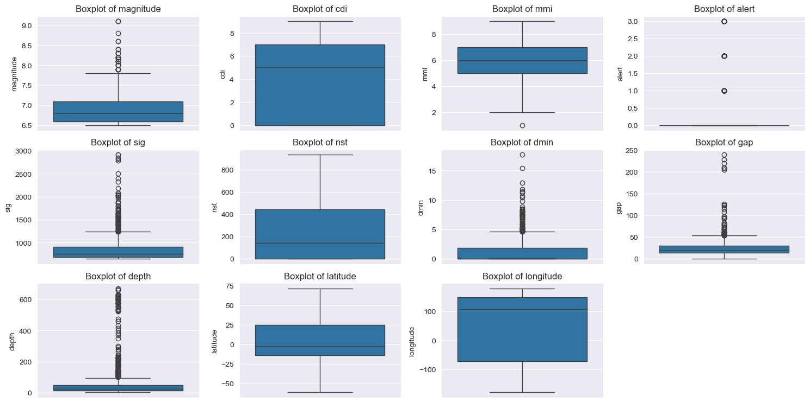
    


#### Extreme outliers issue

From these boxplots we can see that several features have significant outliers, including `magnitude`, `sig`, `nst`, `dmin`, `gap`, and `depth`. These outliers could potentially impact model performance, especially for algorithms sensitive to extreme values like logistic regression and neural networks.


```python
features_of_interest = ['magnitude', 'sig', 'nst', 'dmin', 'gap', 'depth']
plt.figure(figsize=(15,10))
for i, col in enumerate(features_of_interest):
    plt.subplot(4, 4, i + 1)
    sns.violinplot(y=X[col])
    plt.title(f'Violin Plot of {col}')
plt.tight_layout()
plt.show()
```


    
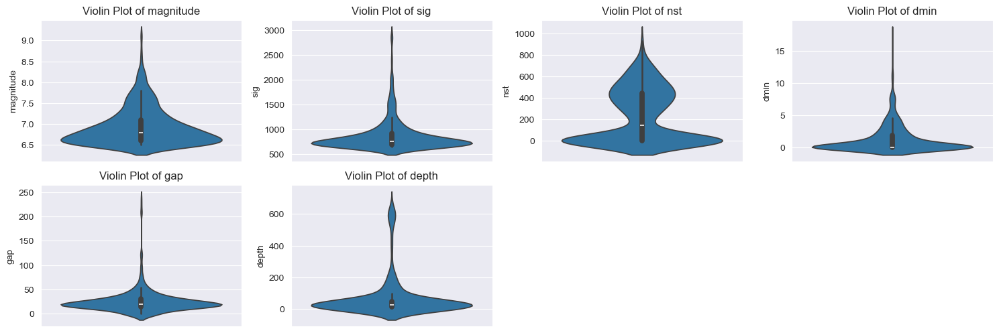
    


Our various violin plots above confirm the presence of extreme outliers in these features, as indicated by the long tails extending from the main distribution. We can see that the majority of data points are concentrated in a smaller range, while a few extreme values stretch far beyond this range, indicating the presence of outliers.


```python
for col in features_of_interest:
    min_value = X[col].min()
    print(f'Minimum value in {col}: {min_value}')
```

    Minimum value in magnitude: 6.5
    Minimum value in sig: 650
    Minimum value in nst: 0
    Minimum value in dmin: 0.0
    Minimum value in gap: 0.0
    Minimum value in depth: 2.7


Good seems all minimum values are positive so we can apply log transformation directly.

We will use log1p transformation which is log(1 + x). This is useful because it can handle zero values without resulting in undefined values, and it compresses the scale of the data, reducing the impact of extreme outliers while preserving the relative differences between values.


```python
X[features_of_interest] = X[features_of_interest].apply(lambda x: np.log1p(x))
plt.figure(figsize=(15,10))
for i, col in enumerate(features_of_interest):
    plt.subplot(4, 4, i + 1)
    sns.violinplot(y=X[col])
    sns.boxplot(y=X[col])
    plt.title(f'Violin Plot of {col} after Log Transformation')
plt.tight_layout()
plt.show()
```


    
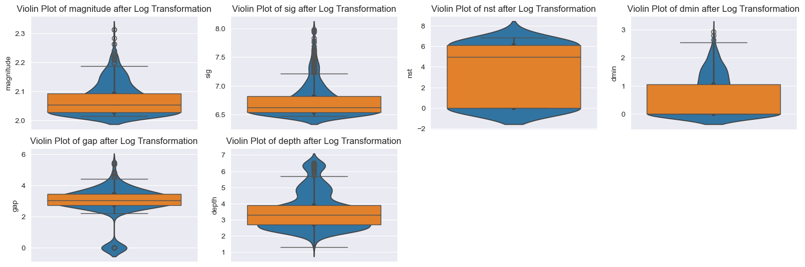
    


Figure 3: Violin Plots of Features After Log Transformation

We can see that after log transformation, the distributions of these features are more compact, and the extreme outliers have been reduced in influence. The main body of the data is now more prominent, with a large portion of the data concentrated in a smaller range, making it easier for models to learn from the data without being overly influenced by extreme values.

Most of our values are still concentrated towards the lower end of the scale, which is expected given the left-skewed distributions we observed earlier in figure 1. However, the log transformation has helped to mitigate the impact of extreme outliers, making the data more suitable for modeling and addressed this skew to an extent.


```python
print(X.isnull().sum().sum())
```

    0


```python
#Correlation matrix heatmap
corr_matrix = X[non_encoded_render].corr()
plt.figure(figsize=(12,8))
sns.heatmap(corr_matrix, annot=True)
plt.title('Correlation Matrix Heatmap')
plt.show()
```


    
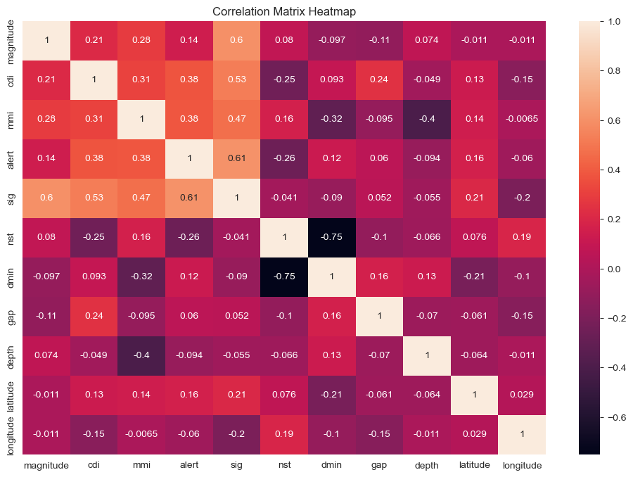
    


None of our features seem too highly correlated (above 0.9) so we don't need to drop any features due to multicollinearity.


```python
#check for duplicate rows
duplicate_rows = X.duplicated().sum()
print(f'Number of duplicate rows in X: {duplicate_rows}')
```

    Number of duplicate rows in X: 0


### Scaling our features

We must scale our features which are now all numerical to ensure they are on a comparable scale. This is important because features with larger ranges can dominate the learning process and lead to unstable model training and convergence issues.

If a feature is too large, its weight will dominate the output of its corresponding neuron, making it difficult for the model to learn from other features. Conversely, if a feature is too small, its weight will have little impact on the output, making it hard for the model to learn from that feature.

Furthermore, if the feature is large and dominates the output of the neuron, its weights cost function derivative (its gradient) will also be large, leading to larger weight updates during backpropagation. This can cause the model to overshoot the optimal weights and result in unstable training. On the other hand, if the feature is small, its weights cost function derivative will be small, leading to smaller weight updates during backpropagation. This can slow down the learning process and make it difficult for the model to converge to the optimal weights.

We can avoid these issues by scaling our features to a similar range, ensuring that no single feature dominates the learning process and allowing the model to learn from all features effectively without being influenced by their original scales.

We will be using StandardScalar, which is z-score normalization, to scale our features. This scales the features to have a mean of 0 and a standard deviation of 1.


```python
from sklearn.preprocessing import StandardScaler
scaler = StandardScaler() #This is z-score normalization
date_time, X = X['date_time'], X.drop(columns=['date_time'])
X[X.columns] = scaler.fit_transform(X[X.columns])
X = pd.concat([X, date_time], axis=1) #put date_time back in after scaling
X
```


<div>
<style scoped>
    .dataframe tbody tr th:only-of-type {
        vertical-align: middle;
    }

    .dataframe tbody tr th {
        vertical-align: top;
    }

    .dataframe thead th {
        text-align: right;
    }
</style>
<table border="1" class="dataframe">
  <thead>
    <tr style="text-align: right;">
      <th></th>
      <th>magnitude</th>
      <th>cdi</th>
      <th>mmi</th>
      <th>alert</th>
      <th>sig</th>
      <th>nst</th>
      <th>dmin</th>
      <th>gap</th>
      <th>depth</th>
      <th>latitude</th>
      <th>...</th>
      <th>location_vec_41</th>
      <th>location_vec_42</th>
      <th>location_vec_43</th>
      <th>location_vec_44</th>
      <th>location_vec_45</th>
      <th>location_vec_46</th>
      <th>location_vec_47</th>
      <th>location_vec_48</th>
      <th>location_vec_49</th>
      <th>date_time</th>
    </tr>
  </thead>
  <tbody>
    <tr>
      <th>0</th>
      <td>0.162774</td>
      <td>1.153766</td>
      <td>0.705717</td>
      <td>-0.322521</td>
      <td>-0.289659</td>
      <td>0.532874</td>
      <td>-0.195534</td>
      <td>-0.005242</td>
      <td>-0.758335</td>
      <td>-0.495089</td>
      <td>...</td>
      <td>1.453208</td>
      <td>0.023658</td>
      <td>0.735194</td>
      <td>-1.242180</td>
      <td>-0.338579</td>
      <td>-0.015908</td>
      <td>-1.410500</td>
      <td>-1.344590</td>
      <td>0.357177</td>
      <td>2022-11-22 02:03:00</td>
    </tr>
    <tr>
      <th>1</th>
      <td>-0.069344</td>
      <td>-0.108571</td>
      <td>-1.358440</td>
      <td>-0.322521</td>
      <td>-0.448762</td>
      <td>0.477711</td>
      <td>0.893716</td>
      <td>0.637522</td>
      <td>-0.255269</td>
      <td>-0.317294</td>
      <td>...</td>
      <td>0.049262</td>
      <td>0.167617</td>
      <td>-0.447381</td>
      <td>0.817142</td>
      <td>0.946989</td>
      <td>-0.797048</td>
      <td>0.470077</td>
      <td>0.569303</td>
      <td>-1.120814</td>
      <td>2022-11-18 13:37:00</td>
    </tr>
    <tr>
      <th>2</th>
      <td>0.162774</td>
      <td>-0.424155</td>
      <td>-2.046492</td>
      <td>-0.322521</td>
      <td>-0.351505</td>
      <td>0.608372</td>
      <td>1.244368</td>
      <td>0.047019</td>
      <td>2.584464</td>
      <td>-0.871753</td>
      <td>...</td>
      <td>0.488537</td>
      <td>-0.974286</td>
      <td>1.484007</td>
      <td>-0.619862</td>
      <td>1.514396</td>
      <td>-2.253036</td>
      <td>0.167222</td>
      <td>1.796242</td>
      <td>-0.672091</td>
      <td>2022-11-12 07:09:00</td>
    </tr>
    <tr>
      <th>3</th>
      <td>0.842108</td>
      <td>0.207014</td>
      <td>-0.670387</td>
      <td>-0.322521</td>
      <td>0.004681</td>
      <td>0.612846</td>
      <td>0.722460</td>
      <td>0.188725</td>
      <td>0.091808</td>
      <td>-0.843874</td>
      <td>...</td>
      <td>0.529675</td>
      <td>-1.021904</td>
      <td>1.139327</td>
      <td>-0.854790</td>
      <td>2.487709</td>
      <td>-0.446643</td>
      <td>0.007634</td>
      <td>1.547238</td>
      <td>-0.348639</td>
      <td>2022-11-11 10:48:00</td>
    </tr>
    <tr>
      <th>5</th>
      <td>0.162774</td>
      <td>-0.108571</td>
      <td>-2.046492</td>
      <td>-0.322521</td>
      <td>-0.351505</td>
      <td>0.596918</td>
      <td>1.676451</td>
      <td>0.386679</td>
      <td>2.704024</td>
      <td>-1.091900</td>
      <td>...</td>
      <td>0.242293</td>
      <td>-0.607653</td>
      <td>1.489147</td>
      <td>-0.960265</td>
      <td>-0.000252</td>
      <td>-0.608067</td>
      <td>-0.672188</td>
      <td>0.176893</td>
      <td>-0.535702</td>
      <td>2022-11-09 09:51:00</td>
    </tr>
    <tr>
      <th>...</th>
      <td>...</td>
      <td>...</td>
      <td>...</td>
      <td>...</td>
      <td>...</td>
      <td>...</td>
      <td>...</td>
      <td>...</td>
      <td>...</td>
      <td>...</td>
      <td>...</td>
      <td>...</td>
      <td>...</td>
      <td>...</td>
      <td>...</td>
      <td>...</td>
      <td>...</td>
      <td>...</td>
      <td>...</td>
      <td>...</td>
      <td>...</td>
    </tr>
    <tr>
      <th>777</th>
      <td>1.710651</td>
      <td>-1.370908</td>
      <td>1.393770</td>
      <td>-0.322521</td>
      <td>0.332974</td>
      <td>0.962288</td>
      <td>-0.784667</td>
      <td>-2.799066</td>
      <td>0.524671</td>
      <td>0.344054</td>
      <td>...</td>
      <td>0.583647</td>
      <td>-0.420742</td>
      <td>-0.922482</td>
      <td>0.004574</td>
      <td>-2.152040</td>
      <td>-2.061084</td>
      <td>-1.355870</td>
      <td>0.951364</td>
      <td>1.167415</td>
      <td>2001-01-13 17:33:00</td>
    </tr>
    <tr>
      <th>778</th>
      <td>-0.069344</td>
      <td>0.207014</td>
      <td>0.705717</td>
      <td>-0.322521</td>
      <td>-0.399807</td>
      <td>-1.057109</td>
      <td>-0.784667</td>
      <td>-2.799066</td>
      <td>0.077251</td>
      <td>1.950156</td>
      <td>...</td>
      <td>0.497820</td>
      <td>-0.883464</td>
      <td>2.433034</td>
      <td>-0.259303</td>
      <td>-1.250744</td>
      <td>0.290914</td>
      <td>-0.791839</td>
      <td>-0.817239</td>
      <td>1.073688</td>
      <td>2001-01-10 16:02:00</td>
    </tr>
    <tr>
      <th>779</th>
      <td>0.392008</td>
      <td>-1.370908</td>
      <td>0.705717</td>
      <td>-0.322521</td>
      <td>-0.252117</td>
      <td>0.916447</td>
      <td>-0.784667</td>
      <td>-2.799066</td>
      <td>1.012619</td>
      <td>-0.683584</td>
      <td>...</td>
      <td>1.267256</td>
      <td>-0.717739</td>
      <td>-0.604297</td>
      <td>-1.157020</td>
      <td>-0.015632</td>
      <td>0.122620</td>
      <td>0.472447</td>
      <td>1.550957</td>
      <td>-0.240340</td>
      <td>2001-01-09 16:49:00</td>
    </tr>
    <tr>
      <th>780</th>
      <td>-0.304419</td>
      <td>-1.370908</td>
      <td>-0.670387</td>
      <td>-0.322521</td>
      <td>-0.569019</td>
      <td>0.334139</td>
      <td>-0.784667</td>
      <td>-2.799066</td>
      <td>-0.009918</td>
      <td>0.108311</td>
      <td>...</td>
      <td>-0.228526</td>
      <td>-0.264257</td>
      <td>-1.208248</td>
      <td>0.367773</td>
      <td>-0.850162</td>
      <td>-0.326202</td>
      <td>-0.507851</td>
      <td>0.185717</td>
      <td>0.196174</td>
      <td>2001-01-01 08:54:00</td>
    </tr>
    <tr>
      <th>781</th>
      <td>1.281489</td>
      <td>-1.370908</td>
      <td>0.705717</td>
      <td>-0.322521</td>
      <td>0.141260</td>
      <td>0.870536</td>
      <td>-0.784667</td>
      <td>-2.799066</td>
      <td>-0.009918</td>
      <td>0.118119</td>
      <td>...</td>
      <td>-0.228526</td>
      <td>-0.264257</td>
      <td>-1.208248</td>
      <td>0.367773</td>
      <td>-0.850162</td>
      <td>-0.326202</td>
      <td>-0.507851</td>
      <td>0.185717</td>
      <td>0.196174</td>
      <td>2001-01-01 06:57:00</td>
    </tr>
  </tbody>
</table>
<p>779 rows × 131 columns</p>
</div>


```python
X.shape
```


    (779, 131)


### An imbalnced dataset


```python
plt.figure(figsize=(6,6))
plt.pie(y.value_counts(), labels=['No Tsunami (0)', 'Tsunami (1)'], autopct='%1.1f%%')
plt.title('Tsunami vs Non-Tsunami Events')
plt.axis('equal')
plt.show()
```


    
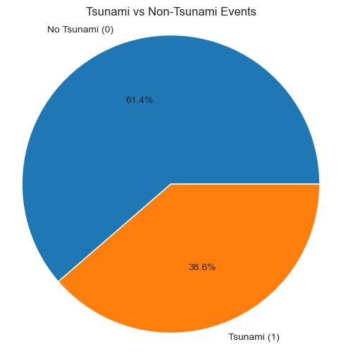
    


This pie chart shows that our dataset is imbalanced, with a significantly higher proportion of non-tsunami events (0) compared to tsunami events (1). This imbalance can pose challenges for modeling, as models may become biased towards the majority class and struggle to accurately predict the minority class.

#### Class weights

In order to address this class imbalance during model training, we can use class weights. Class weights assign a higher weight to the minority class (tsunami events) and a lower weight to the majority class (non-tsunami events). This helps the model pay more attention to the minority class during training, improving its ability to correctly classify tsunami events.

When using class weights, the model will receive a higher cost for misclassifying tsunami events compared to non-tsunami events. This encourages the model to learn patterns that are more relevant for predicting tsunami occurrences, ultimately leading to better performance on the minority class.

#### Left Skewed Features

We can also see in our earlier visualizations that several features have left skewed distributions, shown in both figure 1 and figure 3. We are limited in how we can address this skewness due to the small dataset size of 779 samples. However, we have already applied log transformation to several features with extreme outliers which has helped to reduce skewness and make the distributions more compact.

This skewness may still impact model performance, especially for algorithms that assume normally distributed features, such as logistic regression. However, given our dataset size constraints, we will proceed with the current feature distributions.


### Data quality summary

Through out the EDA and data preprocessing steps, we have identified and addressed several data quality issues that could impact our modeling efforts:

- The dataset is generally small with only 779 samples after cleaning, which limits the complexity of models we can use without overfitting. We have taken care to avoid overfitting.

 - It seems our dataset has a left skewed distribution of across serveral features, which may impact model performance. However, given our dataset size constraints, we have applied log transformation to features with extreme outliers to help reduce skewness where possible.

- We identified and handled missing values in several features using appropriate imputation strategies based on the nature of the data and relationships between features. However, this is not a perfect solution, and some uncertainty remains due to the imputation process, but given the limitation created by the missing data and our dataset size, this is the best approach available.

- Our dataset is not only small but also from 2001 until 2023 (C. Chauhan, 2024), given the influence of climate change on natural disasters, there is a possibility that patterns in the data may have shifted after the data collection period. This introduces additional uncertainty, as the model may not fully capture current trends in earthquake and tsunami occurrences.

- USGS is our sole data source, which may introduce collection bias or limitations based on their data collection methods and coverage. Relying on a single source can limit the diversity of data and potentially overlook important factors influencing tsunami occurrences. This is confirmed by (US. Geological Survey, no date) which acknowledges that not all earthquakes are recorded and minor earthquakes within the United States are more likely to be captured than those in other regions.

Reference: U.S. Geological Survey, (no date) Why is the earthquake that was reported/recorded by network X, or that I felt, not on the Latest Earthquakes map/list? [online] Available at: https://www.usgs.gov/faqs/why-earthquake-was-reportedrecorded-network-x-or-i-felt-not-latest-earthquakes-maplist [Accessed 4 November 2025].


#### Feature Reduction


```python
print('')
```


```python
#TODO: Hyperparameter tuning (Grid and Randomized Search)
```


```python
#TODO: explore auto parameter tuning
```
